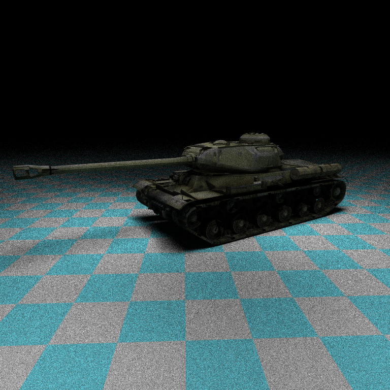

	

# Raytracer
This repository contains a basic raytracer written in Rust. Its purpose is to learn ray tracing methods and Rust simultaneously. It is based on the [Ray Tracing in One Weekend](https://raytracing.github.io/books/RayTracingInOneWeekend.html) book.
